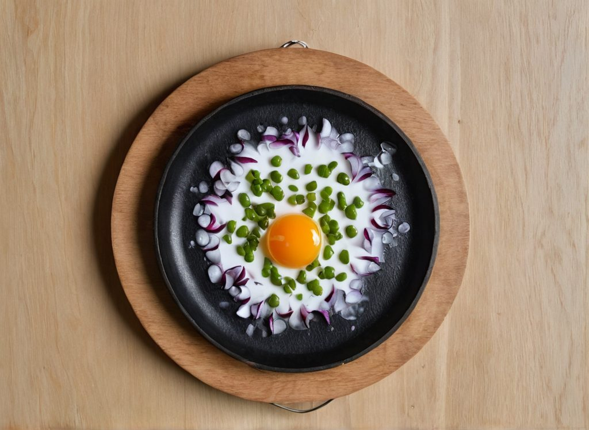
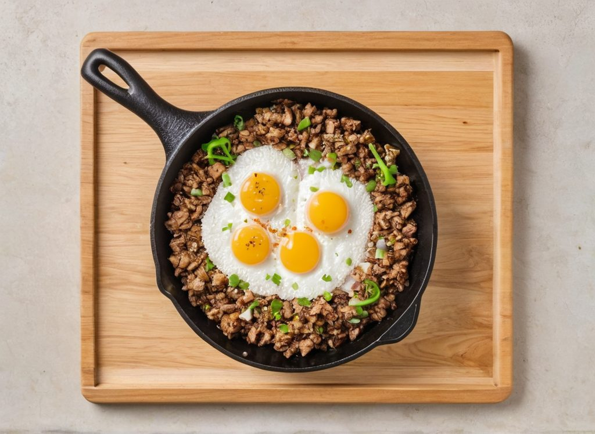
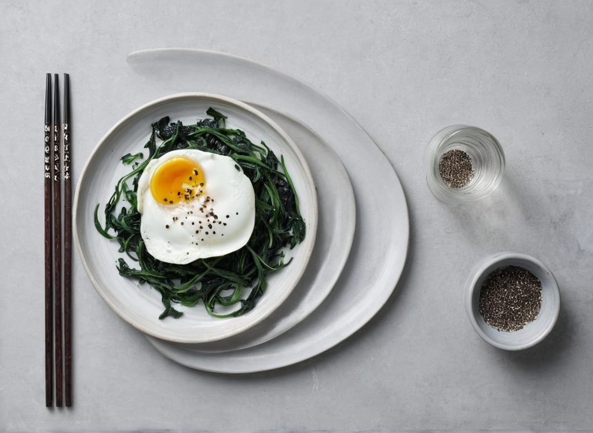
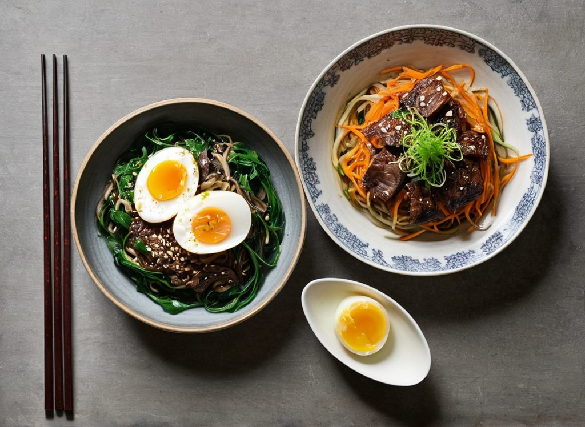
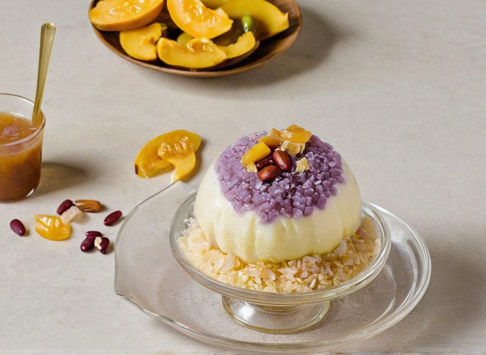
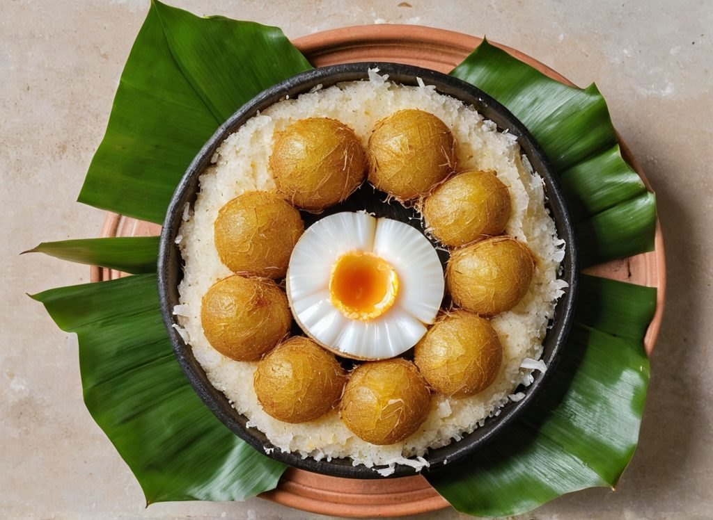

# What image models get wrong about Filipino food

*Measured 2026-08-01. Mac Studio M2 Max, MPS, ComfyUI 0.29.0, Juggernaut XL v9
(SDXL), 1216×888, 28 steps, CFG 6.5, dpmpp_2m/karras.*

The plan was to spend a few hours answering one question — *can SDXL render
Filipino food, or does this project not work?* — before writing thirty prompts
against a base model that might be wrong.

It answered a different question, and the answer was more useful.

**The base model was never the problem. The prompt design was.**

---

## The first image

Everything was in place: ComfyUI on MPS, a carefully written dish dictionary, a
prompt assembler that merged dish description with cuisine vocabulary and
lighting preset. The first real generation used sisig — minced crispy pork on a
sizzling cast iron plate, one of the most recognisable dishes in the country.



A fried egg with red onion and green peas. **No pork at all.**

## Why this happened

The dictionary entry had a negative prompt listing the dishes sisig gets
confused with:

```
pulled pork, taco filling, ground beef, chinese minced pork stir fry,
korean bulgogi, fried rice, hash browns, corned beef hash, curry,
whole pork chop, bacon bits, chili con carne, sloppy joe
```

Every term is individually defensible. Sisig genuinely does get confused with
all of those. That list was the *point* of the dictionary.

Read them together, though, and they describe one thing: **browned minced
meat.** Which is also what sisig is.

## Isolating it

Four variants, seed 42, everything else held constant:

| # | Positive | Negative | Result |
|---|---|---|---|
| 0 | full (186w) | **full (103w)** | No meat. Fried egg and peas. |
| A | full (186w) | universal only (12w) | **Correct sisig** |
| B | short (80w) | **full (103w)** | Meat present but **pale, raw, no browning** |
| C | short (80w) | universal only (12w) | Correct sisig |

Prompt *length* wasn't the variable — the longest positive prompt produced the
best image. The negative was.

**Variant B is the diagnostic one.** The meat comes back, but grey and
uncooked-looking. The negatives named several browned-minced-meat dishes, and
the model dutifully removed the *browning* while keeping the *mince*. It did
exactly what it was told.

Dropping the food negatives entirely:



## Confirming it wasn't a one-off

Japchae was the ideal control, because it's the canonical drift case — Korean
glass noodles that image models love to render as Chinese chow mein. Its
negative listed ten noodle types precisely to stop that.

**With the full negative prompt:**



No noodles. Wilted spinach and an egg. Negating ten kinds of noodle removed
noodles.

**With universal negatives only:**



Noodles, beef, carrot, spinach, sesame. And — this is the part that reversed
the design — **it did not drift to chow mein.**

## The mechanism, and the rule

**Diffusion negatives operate on visual features, not on dish identity.**

"Corned beef hash" and sisig share browning, mincing and a skillet. The model
has no concept of *"the dish named corned beef hash, as distinct from the dish
named sisig."* It has features. Negating one dish subtracts every feature it
shares with your subject.

You cannot negate a lookalike without negating the likeness.

The damage was also dose-dependent: eight terms degraded the subject, ten
deleted it.

And the drift those anchors existed to prevent didn't materialise without them,
because the positive prompt was already doing that work:

> *"translucent grey-brown sweet potato starch glass noodles that catch the
> light and look glassy and slippery rather than floury or opaque"*

That sentence distinguishes japchae from chow mein far more effectively than
negating chow mein does — and it does it by **adding** signal rather than
subtracting it.

> **The rule: distinguish in the positive. Never negate a food that resembles
> the subject.**

Negatives are for rendering artifacts and wrong media — *text, watermark,
blurry, cartoon, 3D render*. None of those names a food, so none can subtract a
feature the dish needs.

## The second finding: kakanin fail differently

Fixing the negatives moved sisig from a 2 to a 4 and japchae from a 1 to a 3. It
did nothing for Filipino desserts.

**Halo-halo** — shaved ice in a tall glass, layered with beans, jellies,
jackfruit, leche flan and ube:



A smooth pudding dome. The ingredients are all present — kaong, red beans,
jackfruit, pinipig, ube — but scattered *around* the dish instead of layered
*inside* it. No shaved ice. No tall glass.

**Bibingka** — a flat rice cake baked on a banana leaf in a clay dish:



Banana leaf: correct. Clay vessel: correct. Coconut: correct. Salted egg:
correct. Flat: no. It rendered golden balls.

This is a **different class of failure**. With sisig the model lacked features
and the prompt supplied them. With bibingka the model has every ingredient
right and the **physical structure** wrong. It knows what goes into a bibingka.
It does not know that a bibingka is flat.

Prompt wording doesn't reliably override a structural prior. The realistic
options are reference-image conditioning, a small LoRA trained on a few dozen
photographs, or shipping savoury dishes first and desserts later.

## Timings, since that was the original question

| Operation | Seconds |
|---|---|
| Generation, warm | 64–85 (68 median) |
| Generation, cold — 6.6 GB into unified memory | 112 |
| Upscale to 4000×2925 (Foodpanda's minimum) | 9.2 |

Cold generation plus upscale is ~121 seconds — past Cloudflare's 100-second
edge timeout. The async submit-then-poll API isn't defensive design; a
synchronous endpoint would simply fail.

## What I'd take from this

**Run it before you write thirty of them.** Every negative term in that
dictionary was defensible on paper, and the whole approach was wrong. No amount
of review catches this. One generation does.

**Adding signal beats subtracting noise.** The instinct with a model that keeps
producing the wrong thing is to enumerate what you don't want. That instinct is
backwards. Describing what the dish actually looks like — the sheen, the char,
the specific translucency of sweet potato starch noodles — outperformed
negation and had no collateral damage.

**A benchmark's job is to be allowed to surprise you.** This one was scoped to
choose between two checkpoints. It never got to that comparison, and it was
still the most valuable few hours in the project — because it was pointed at
real output early enough for the answer to change what got built.
